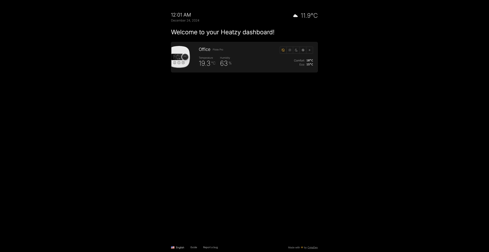
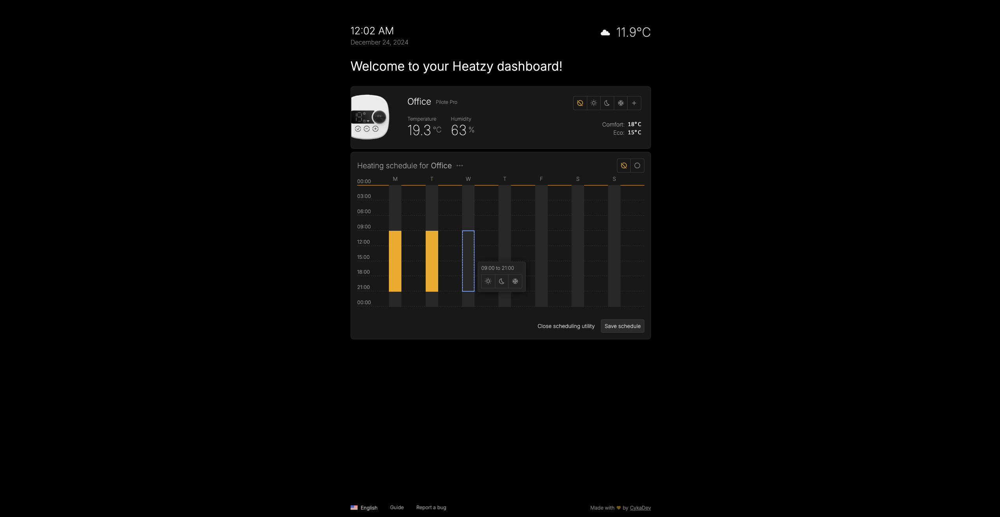
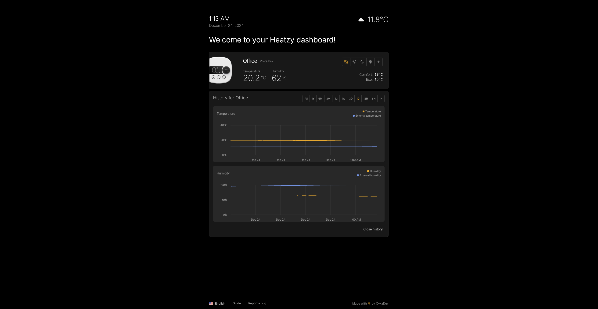
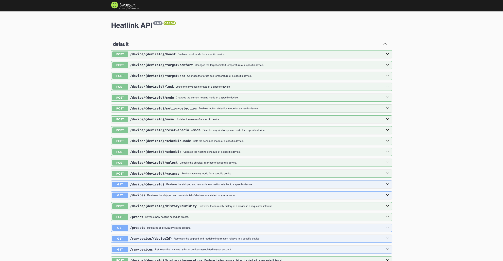

# 🚀 HeatLink: Simplify Your Heating, Your Way 🔥

Welcome to **HeatLink**, the ultimate bridge between you and your Heatzy heating modules. Say goodbye to clunky apps and hello to a streamlined, customizable heating control experience. Built with love and crafted for simplicity, HeatLink is your perfect companion for a smarter, warmer home. 🌡️

---

## ⚠️ Important Note

**HeatLink currently supports only Heatzy Pro modules.** Classic Heatzy modules are not yet supported, but don’t worry—I’m working on it! As soon as I get my hands on a classic Heatzy module, I’ll start integrating support for it.

---

## 🌟 Features

HeatLink includes **all the features from the original Heatzy app** and adds some exciting extras:

- **📈 Temperature & Humidity History:** View detailed historical data to better understand and optimize your heating patterns.
- **🗓️ Heating Schedule Presets:** Create and save presets for your heating schedules to quickly switch between configurations.
- **📋 Schedule Duplication:** Duplicate schedules between devices or copy one day’s schedule to other days for faster setup.
- **🌡️ OpenMeteo Integration (Optional):** Display external temperature and humidity for comparison with Heatzy device readings.
- **📚 In-App Documentation:** Comprehensive guides to master every aspect of Heatzy devices and the HeatLink app.
- **🧩 Documented API & Swagger UI:** Easily interact with the HeatLink API and retrieve readable data about your devices.
- **📱 PWA Support:** Install HeatLink as a Progressive Web App (PWA) on your mobile device for a native app-like experience. Manage your heating on the go, just like a mobile app.

---

## 🎯 Why HeatLink?

Smart home tech can feel anything but smart sometimes. That’s why HeatLink is designed to be:

- **⚡ Fast:** Because who has time for delays?
- **💡 Minimalist:** We keep it simple, so you stay in control.
- **🛠️ Extensible:** Ready for your custom use cases and integrations.

---

## 🌐 Environment Variables

When hosting HeatLink, the following environment variables should be configured to ensure proper functionality:

| Variable        | Description                                                                                      | Example Value            |
|------------------|--------------------------------------------------------------------------------------------------|--------------------------|
| `USERNAME`      | Your Heatzy account email                                                                        | `your.email@example.com` |
| `PASSWORD`      | Your Heatzy account password                                                                     | `supersecretpassword`    |
| `LATITUDE`      | Latitude for weather data (used to integrate with OpenMeteo, optional)                           | `37.2343`                |
| `LONGITUDE`     | Longitude for weather data (used to integrate with OpenMeteo, optional)                          | `-115.8066`              |
| `ARCHIVAL_CRON` | CRON expression for archiving module temperatures in history (Optional, defaults to `0 * * * *`) | `0 0 * * *`              |

---

## 🐳 Docker Setup

HeatLink can be deployed quickly using Docker. Here's how you can get started:

### 📝 Example `docker-compose.yml`

```yaml
version: '3.8'
services:
  heatlink:
    image: paulchartres/heatlink
    container_name: heatlink
    environment:
      - USERNAME=your.email@example.com
      - PASSWORD=supersecretpassword
      - LATITUDE=37.2343 # Optional, but required if you want to use the weather and external temperature/humidity feature
      - LONGITUDE=-115.8066 # Optional, but required if you want to use the weather and external temperature/humidity feature
      - ARCHIVAL_CRON=0 * * * * # Optional, defaults to every minute
    volumes:
      - ./data:/app/data # Map the container's data directory to your host (for the SQLite database)
    ports:
      - "3000:3000" # Map the container's port 3000 to your host
    restart: always
```

Run the following command to start the container:

```bash
docker-compose up -d
```

You can also find an example `docker-compose.example.yml` file in the repository.

---

### 🛠️ Running with `docker run`

If you prefer running the container directly, use the following command:

```bash
docker run -d \
  --name heatlink \
  -p 3000:3000 \
  -v /path/to/data:/app/data \
  -e USERNAME=your.email@example.com \
  -e PASSWORD=supersecretpassword \
  -e LATITUDE=37.2343 \
  -e LONGITUDE=-115.8066 \
  -e ARCHIVAL_CRON="0 * * * *" \
  paulchartres/heatlink
```

---

### 🧐 Verifying the Setup

After starting the container, HeatLink will be accessible on `http://localhost:3000` (provided you haven't changed the port mappings). Check the logs to ensure everything is running smoothly:

```bash
docker logs -f heatlink
```

---

## 📸 Screenshots

### Main dashboard


### Device scheduling


### Temperature and humidity History


---

## 📄 Swagger UI

HeatLink offers a full Swagger UI to interact with the API and access detailed information about your devices.

- **Access Swagger UI at:** `http://localhost:3000/docs` (or any port you have configured)
- Use it to explore endpoints, test API calls, and view real-time data.



---

## 💻 Tech Stack

HeatLink is powered by modern, reliable technologies to ensure a seamless experience:

- **Frontend:** Built with the elegance of Angular, delivering speed and style.
- **Backend:** Managed with Node.js and Express, because robust APIs is my jam.
- **Database:** SQLite for easy setup and management.
- **Docker:** For quick and easy deployment.
- **Swagger UI:** For a comprehensive API documentation experience.
- **OpenMeteo API:** For external temperature and humidity data.

---

## 🧑‍💻 Starting a Development Instance

To start a development instance of HeatLink:

1. Navigate to the **server** directory and run:
   ```bash
   npm run dev
   ```
2. Navigate to the **frontend** directory and run:
   ```bash
   npm run start
   ```

> **Reminder:** Ensure you have the proper environment variables set before starting the dev instance.

---

## 🤝 Contributing

Contributions are welcome! HeatLink is licensed under the **Apache 2.0 License** with modifications.

### License Modification:
10. The Software is provided to you under the Apache License, as modified by the
    Commons Clause restriction. The Commons Clause restriction prohibits you
    from using the Software in a commercial way, including selling, licensing,
    or distributing it for profit, without explicit permission from the copyright
    holder.

For more information, please refer to the [LICENSE](LICENSE) file.